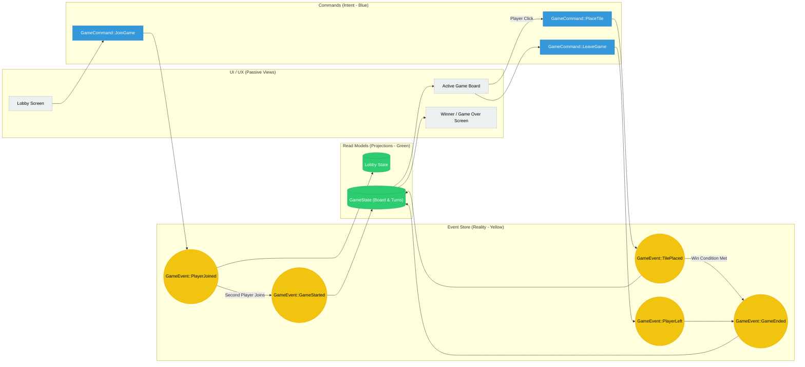

# Tic-Tac-Tussle: Big Picture Event Model

This diagram represents the "Big Picture" of the game's event-sourced lifecycle. It uses the [Event Modeling](https://eventmodeling.org/) pattern, visually represented with Mermaid.

## Modeling Principles Used

1.  **Commands (Blue):** These represent a user's intent to change the system. They are validated against the current state before an event is emitted.
2.  **Events (Yellow):** These represent immutable facts that have already occurred. They are the "source of truth" (Event Sourcing).
3.  **Read Models (Green):** These are projections of the events. They are optimized for the UI to consume. In this project, `GameState` serves as the primary read model for the board.
4.  **Passive UI (Grey):** The UI reflects the current read model and dispatches commands. It does not contain business logic.
