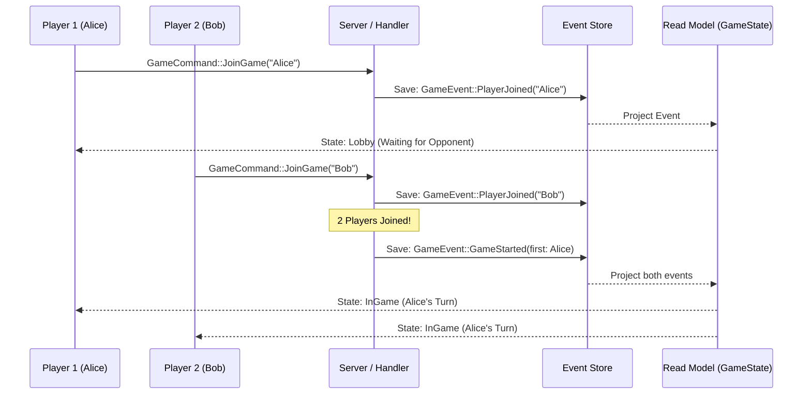
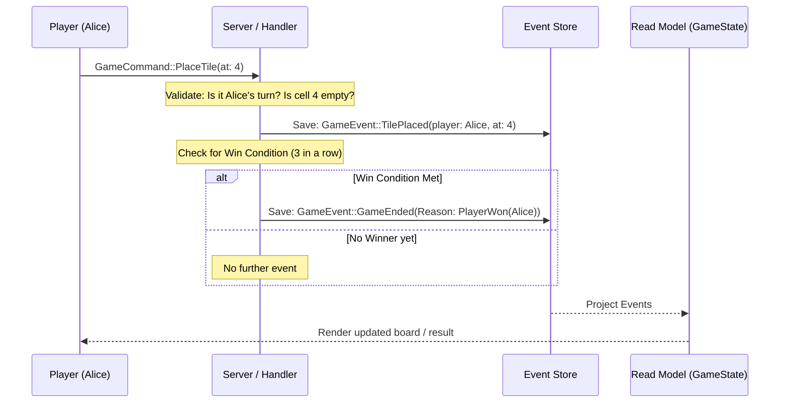
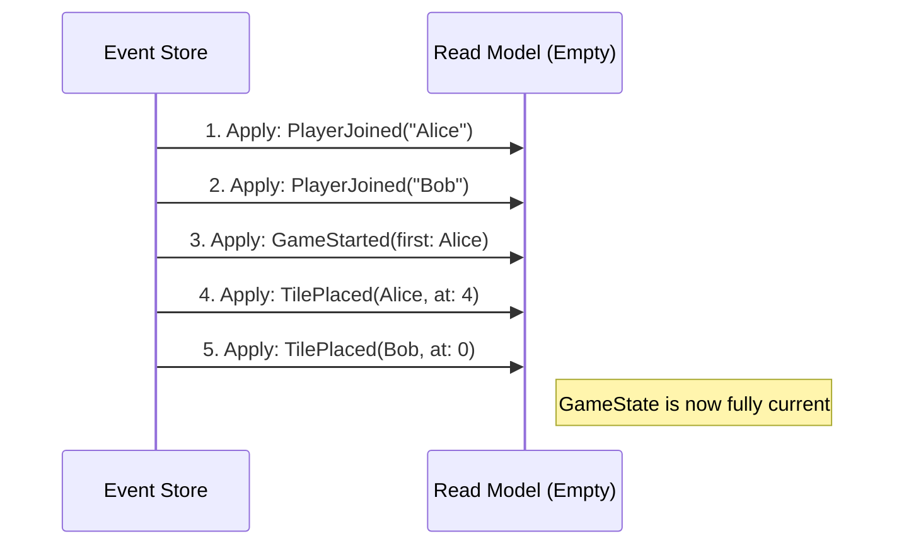

# Tic-Tac-Tussle: Sequence Diagrams

These diagrams illustrate how the system processes specific user interactions in an event-sourced way.

## Player Joins and Game Starts

This interaction shows the transition from a Lobby state to an active Game state once the second player joins.

## Placing a Tile (Move & Validation)

This diagram shows how a move is processed and how it potentially triggers a win condition.

## State Reconstruction (Event Sourcing)

When a player reloads the page or the server restarts, the state is rebuilt by "playing back" all the events from the store.

